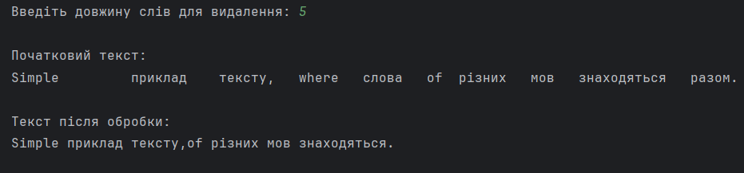

# Лабораторна робота № 4 – Композиція класів
## Варіант: 11
### Опис

Лабораторна робота є модифікацією лабораторної роботи №2.

У межах роботи реалізовано структуру тексту з використанням композиції класів:

Letter → Word → Sentence → Text

Для кожної абстракції створено окремий клас:

- `Letter` — представляє одну літеру;
- `Word` — складається з масиву літер;
- `Punctuation` — представляє розділові знаки;
- `Sentence` — складається зі слів та розділових знаків;
- `Text` — складається з масиву речень;
- `Lab4Composition` — виконавчий клас із методом `main`.

### Реалізований функціонал
- парсинг рядка в ієрархію об’єктів `Text → Sentence → Word + Punctuation`;
- нормалізація форматування рядка:
  заміна послідовностей табуляцій та пробілів одним пробілом;
- видалення з тексту слів заданої довжини, які починаються з приголосної літери;
- формування та виведення фінального обробленого тексту.
### Результат
